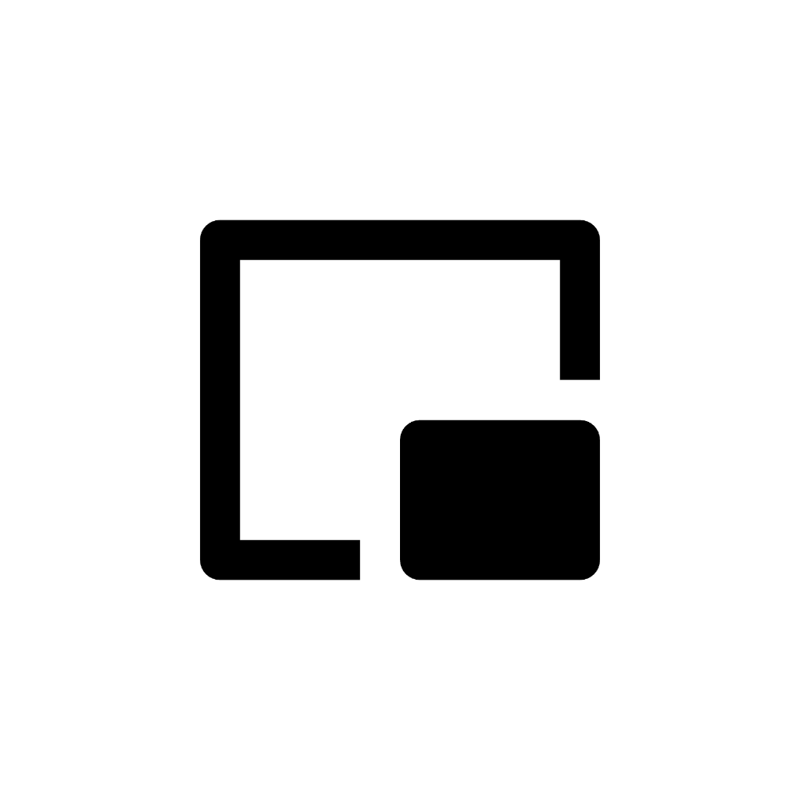

# AwakeDisplay

[English](#english) | [中文](#中文)

<p align="center">
  
</p>

## 中文

**AwakeDisplay** 是一款专为 Apple Silicon (M1/M2/M3) MacBook 打造的极简状态栏（Menu Bar）应用。它通过创建一个虚拟的外接显示器，优雅地触发 macOS 原生的 Clamshell Mode（合盖不休眠模式），而无需任何物理外接显示器或电源。

### ✨ 核心功能
- **零硬件触发合盖模式**：利用系统未公开 API (`CGVirtualDisplay`) 模拟外接显示器连接。
- **画中画实时预览 (PiP)**：内置画中画悬浮窗，当鼠标移动至虚拟显示器区域时，会有优雅的绿点 (`⏺`) 提示。
- **自定义分辨率**：支持一键切换 1080p, 2K, 4K 分辨率，适应不同场景的需求。
- **极简纯原生**：无冗余的 Xcode 工程文件或 Storyboard。全代码实现，构建仅依赖一个 Bash 脚本。
- **智能状态图标**：支持深/浅色模式无缝切换的状态栏 SVG 动态图标。

### 🚀 快速开始

#### 环境要求
- **操作系统**: macOS 13+ (推荐 macOS 14 及以上版本)
- **架构**: Apple Silicon (M1/M2/M3 等)

#### 编译与运行
不需要繁重的 Xcode，只需要在终端运行即可：

```bash
git clone https://github.com/your-username/AwakeDisplay.git
cd AwakeDisplay
sh build.sh
open AwakeDisplay.app
```

#### 注意事项
- **权限**: 画中画 (PiP) 功能需要屏幕录制权限，首次使用时请在「系统设置 -> 隐私与安全性 -> 屏幕录制」中授予。
- **单例限制**: 默认阻止多开运行。
- **镜像模式**: 如果首次开启虚拟显示器发现屏幕变成了镜像模式，请进入系统的「显示器」设置中，将其更改为「扩展显示器」。

### 🛠 技术细节
该项目完全通过原生的 `swiftc` 直接编译生成 `.app` 文件，展示了使用 Swift 调用 C/Objective-C API 和封装 App Bundle 的原生优雅方式。包含 `AVFoundation` 捕捉屏幕、`CoreGraphics` 操作虚拟屏幕的底层运用。

---

## English

**AwakeDisplay** is a minimalist Menu Bar application tailored for Apple Silicon (M1/M2/M3) MacBooks. It elegantly triggers macOS's native Clamshell Mode (closing the lid without sleeping) by creating a virtual external display, without the need for any physical external monitors.

### ✨ Features
- **Zero-Hardware Clamshell Mode**: Simulates an external display connection using the undocumented system API (`CGVirtualDisplay`).
- **Picture-in-Picture (PiP)**: Includes a floating PiP window to monitor the virtual screen, featuring a sleek green dot (`⏺`) indicator when your cursor enters the virtual display.
- **Customizable Resolutions**: Switch easily between 1080p, 2K, and 4K presets to fit your workflow.
- **Pure Native & Minimalist**: No bloated Xcode project files or Storyboards. Pure code implementation, built with a single Bash script.
- **Smart Status Icons**: Dynamic SVG icons in the Menu Bar that seamlessly adapt to Light and Dark modes.

### 🚀 Quick Start

#### Requirements
- **OS**: macOS 13+ (macOS 14+ recommended)
- **Architecture**: Apple Silicon (M1/M2/M3 etc.)

#### Build & Run
No heavy Xcode required. Just use the terminal:

```bash
git clone https://github.com/your-username/AwakeDisplay.git
cd AwakeDisplay
sh build.sh
open AwakeDisplay.app
```

#### Important Notes
- **Permissions**: The Picture-in-Picture (PiP) feature requires Screen Recording permissions. Please grant it in `System Settings -> Privacy & Security -> Screen Recording` upon first use.
- **Singleton**: The app strictly prohibits multiple instances from running simultaneously.
- **Mirror Mode**: If you find your screen mirrored upon the first activation, please go to the system's "Displays" settings and change the virtual display to "Extended Display".

### 🛠 Technical Details
This project demonstrates the elegant, pure-native way of compiling an `.app` bundle directly via `swiftc`. It showcases low-level usages of bridging Swift with C/Objective-C APIs, utilizing `AVFoundation` for screen capture and `CoreGraphics` for virtual display manipulation.

---

## License
MIT License. See [LICENSE](LICENSE) for details.