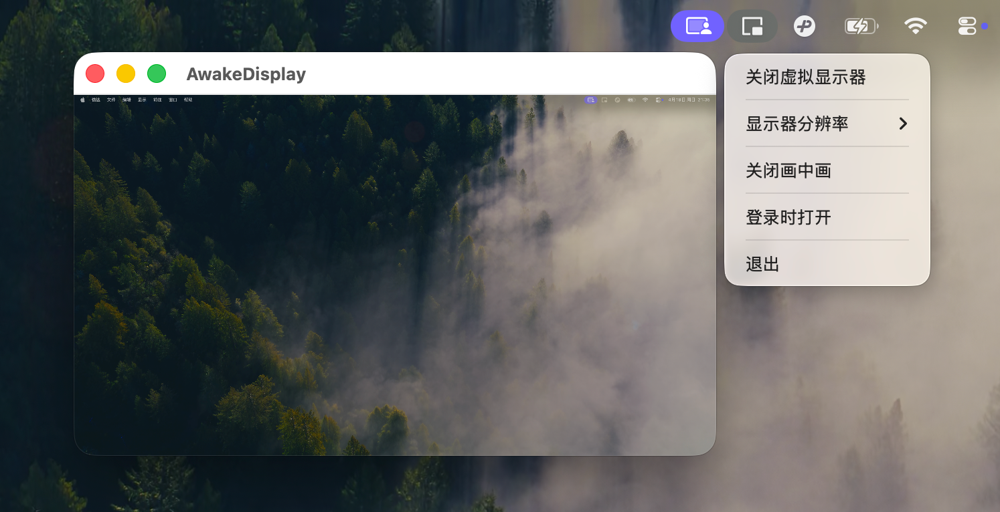

# AwakeDisplay

[English](#english) | [中文](#中文)

## English

**AwakeDisplay** is a minimalist Menu Bar application tailored for Apple Silicon (M1+) MacBooks. It elegantly triggers macOS's native Clamshell Mode (closing the lid without sleeping) by creating a virtual external display, without the need for any physical external monitors or power supply.

### Features

- **Zero-Hardware Clamshell Mode**: Simulates an external display connection using the system API (`CGVirtualDisplay`).
- **Mirror/Extended Dual Modes**: Defaults to "Mirrored Display" mode to prevent the mouse cursor from sliding out of bounds. Supports switching to "Extended Display" mode.
- **Picture-in-Picture (PiP)**: In Extended mode, you can optionally enable a floating PiP window. A green dot indicator will appear when the mouse moves into the virtual display area.
- **Pure Native & Minimalist**: No bloated Xcode project files or Storyboards. Pure code implementation, built with a single Bash script. The application bundle size is under **1 MB**, with near-zero impact on CPU and memory usage.

### Screenshots

<p align="center">
  
</p>

### Quick Start

#### Installation & Run

You can download the pre-compiled App directly from GitHub Releases, or build it yourself from source.

**Method 1: Direct Download (Recommended)**

1. Go to the [Releases](https://github.com/litiantaos/AwakeDisplay/releases) page of this repository.
2. Download the latest `AwakeDisplay.zip`.
3. Unzip and drag `AwakeDisplay.app` into your `Applications` folder, then double-click to run.

**Method 2: Build from Source**

No heavy Xcode required. Just use the terminal:

```bash
git clone https://github.com/litiantaos/AwakeDisplay.git
cd AwakeDisplay
sh build.sh
open AwakeDisplay.app
```

#### Important Notes

- **Gatekeeper Warning**: If you see *"Apple cannot check it for malicious software"* when opening the downloaded app, please don't worry. This is because the app is not signed with a paid Apple Developer certificate. Please open Terminal and run `xattr -cr /Applications/AwakeDisplay.app` to remove the quarantine attribute, or **right-click** the app and select "Open".
- **Permissions**: The Picture-in-Picture (PiP) feature requires Screen Recording permissions. Please grant it in `System Settings -> Privacy & Security -> Screen Recording` upon first use.

---

## 中文

**AwakeDisplay** 是一款专为 Apple Silicon (M1+) MacBook 打造的极简状态栏（Menu Bar）应用。它通过创建一个虚拟的外接显示器，优雅地触发 macOS 原生的 Clamshell Mode（合盖不休眠模式），而无需任何物理外接显示器或电源。

### 核心功能

- **零硬件触发合盖模式**：利用系统 API (`CGVirtualDisplay`) 模拟外接显示器连接。
- **镜像/扩展双模式**：默认「镜像显示器」模式，避免鼠标指针滑出边界，支持切换为「扩展显示器」模式。
- **画中画 (PiP)**：扩展模式可选开启画中画悬浮窗，当鼠标移动至虚拟显示器区域时，会有绿点提示。
- **极简纯原生**：无冗余的 Xcode 工程文件或 Storyboard。全代码实现，构建仅依赖一个 Bash 脚本，且安装包大小不到 **1 MB**，对系统内存和 CPU 的占用几乎为零。

### 应用截图

<p align="center">
  
</p>

### 快速开始

#### 安装与运行

您可以直接从 GitHub Releases 下载预编译好的 App，或者自己从源码构建。

**方式一：直接下载 (推荐)**

1. 前往本仓库的 [Releases](https://github.com/litiantaos/AwakeDisplay/releases) 页面。
2. 下载最新的 `AwakeDisplay.zip`。
3. 解压后将 `AwakeDisplay.app` 拖入您的 `应用程序 (Applications)` 文件夹中，双击运行即可。

**方式二：源码构建**

不需要繁重的 Xcode，只需要在终端运行即可：

```bash
git clone https://github.com/litiantaos/AwakeDisplay.git
cd AwakeDisplay
sh build.sh
open AwakeDisplay.app
```

#### 注意事项

- **安全提示 (Gatekeeper)**: 如果打开时提示 *"Apple 无法验证 AwakeDisplay.app"* 或包含恶意软件等，请勿担心，这是因为应用未付费苹果开发者证书。请在终端执行命令 `xattr -cr /Applications/AwakeDisplay.app` 移除隔离属性，或者 **右键** 应用选择“打开”。
- **权限**: 画中画 (PiP) 功能需要屏幕录制权限，首次使用时请在「系统设置 -> 隐私与安全性 -> 屏幕录制」中授予。

---

## License

MIT License. See [LICENSE](LICENSE) for details.
